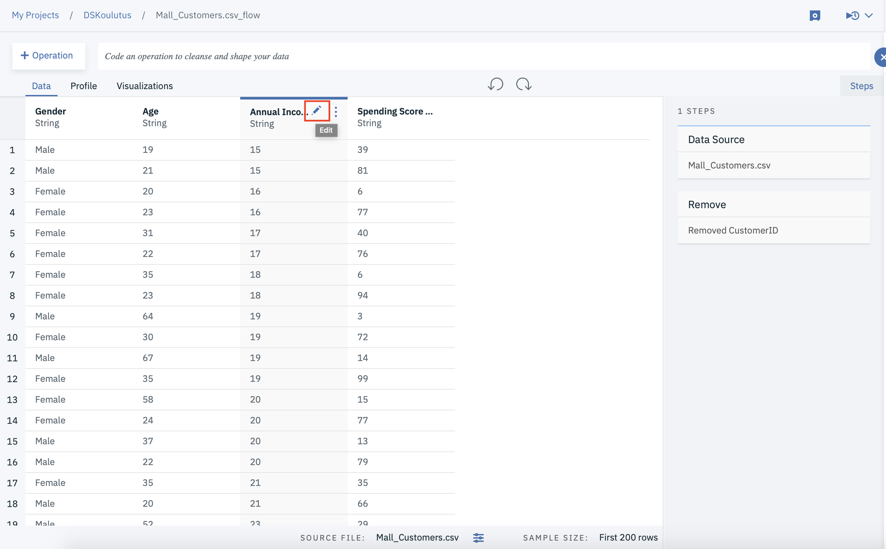
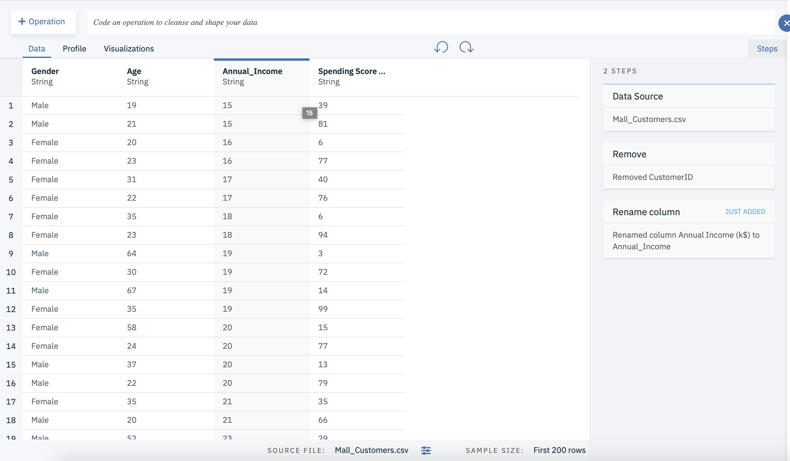
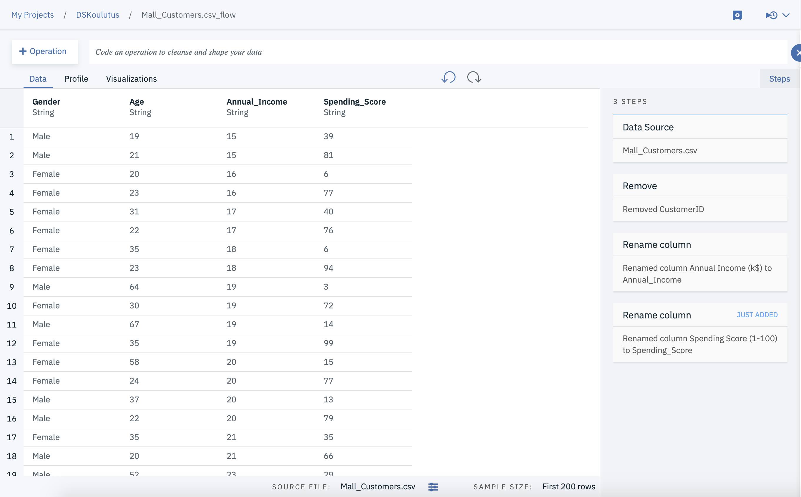

# Datan valmistelu

Tässä vaiheessa poistamme datasta tarpeettoman kolumnin **CustomerID**.

1. Mene Watson Studiossa projektisi Assets sivulle.

2. Avaa Data Refinery painamalla datasetin actionin kohdalla löytyvää kolmea pistettä.

3. Vie hiiri **CustomerID** kolummnin nimen päälle, paina ilmestyvää kolmea pistettä ja valitse **Remove**

4. Nyt datasetti tulisi näyttää tältä

5. Seuraavaksi muokkaamme muuttujie nimeä. Korvaamme välilyönnit muuttujien nimestä ala viivalla, ja poistamme muuttujien selitteet muuttujien nimistä.

6. Vie hiiri **Annual Income (k$)** sarakkeen päälle ja valitse **kynä** ikoni.

7. Muokkaa sarakkeen nimi muotoon **Annual_Income**

8. Toista sama prosessi muuttujalle **Spending Score (1-100)** muuta se muotoon **Spending_Score**

9. Paina seuraavaksi **Jobs** nappulaa ja valitse **Save and create a job**

10. Anna jobille nimi, ja paina **Create and Run**

11. Odota kunnas Status muuttuu **Completed** tilaan ja palaa sitten projektin asset sivulle, painamalla projektin nimeä vasemmalla ylhäällä.

12. Data Asset osioon on nyt tullut uusi datasetti, nimeltää **Mall_Customers.csv_shaped.csv**. Tämä data on nyt mallinnukselle valmisteltu datasetti.

