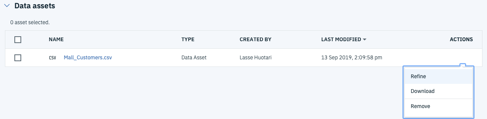
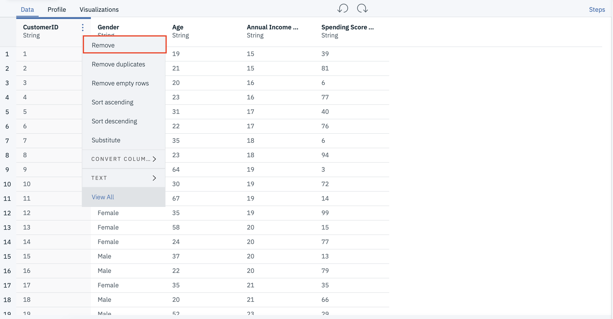
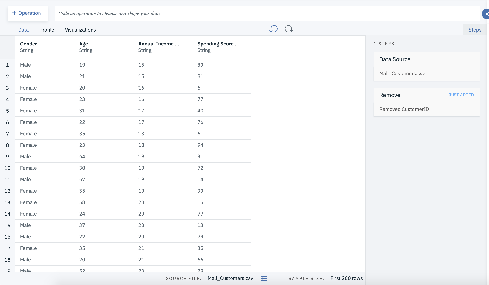
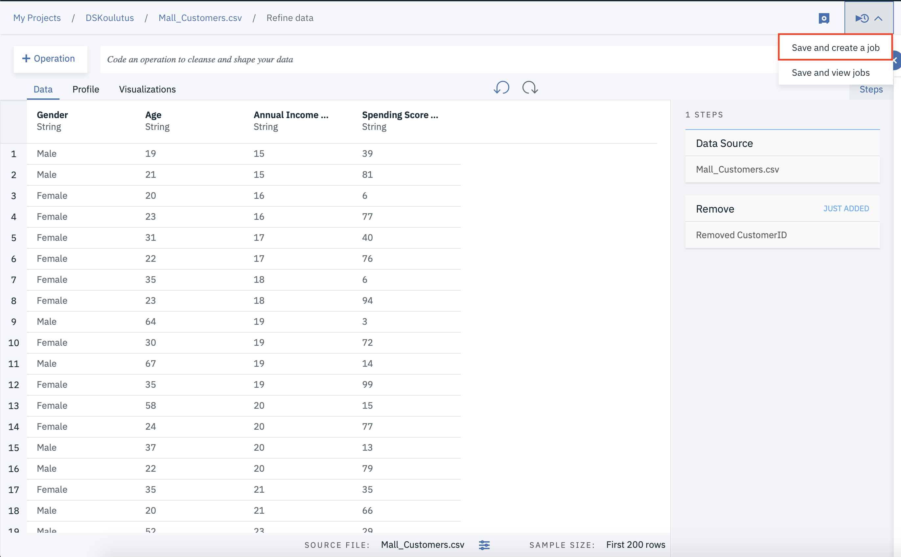
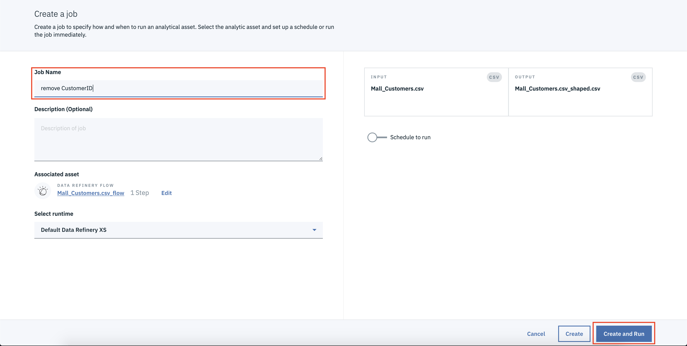
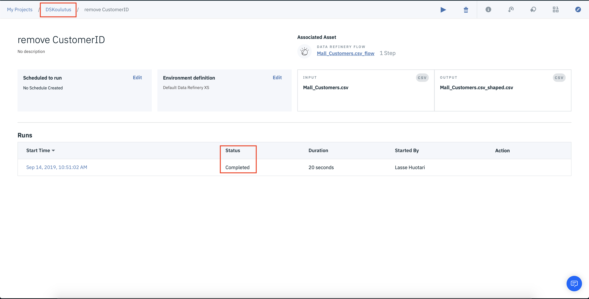
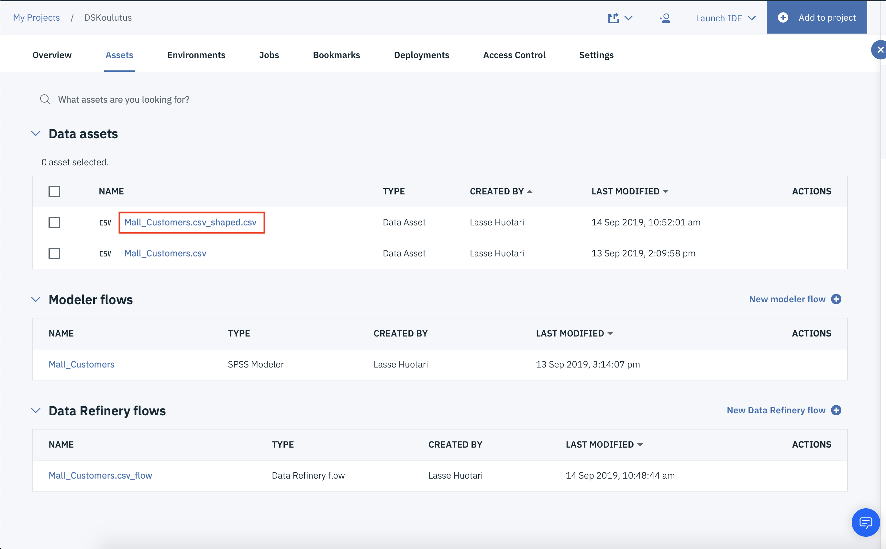

# Datan valmistelu

Tässä vaiheessa poistamme datasta tarpeettoman kolumnin **CustomerID**.

1. Mene Watson Studiossa projektisi Assets sivulle.

2. Avaa Data Refinery painamalla datasetin actionin kohdalla löytyvää kolmea pistettä.

3. Vie hiiri **CustomerID** kolummnin nimen päälle, paina ilmestyvää kolmea pistettä ja valitse **Remove**

4. Nyt datasetti tulisi näyttää tältä

5. Paina seuraavaksi **Jobs** nappulaa ja valitse **Save and create a job**

6. Anna jobille nimi, ja paina **Create and Run**

7. Odota kunnas Status muuttuu **Completed** tilaan ja palaa sitten projektin asset sivulle, painamalla projektin nimeä vasemmalla ylhäällä.

8. Data Asset osioon on nyt tullut uusi datasetti, nimeltää **Mall_Customers.csv_shaped.csv**. Tämä data on nyt mallinnukselle valmisteltu datasetti.

