# Datan ymmärtäminen

1. Käytämme tehtävässä Watson Studion Data Refinery työkalua, työkalu näyttää maksimissaan datasetin 1000 ensimmäistä riviä, mutta käyttämämme datasetti sisältää alle tämän määrän rivejä, joten näemme datasetin kokonaisuudessaan. Avataksesi Data Refinery työkalun, paina kolmea pistettä datasetin oikealla puolella, actions kohdan alla, ja valitse **Refine**.

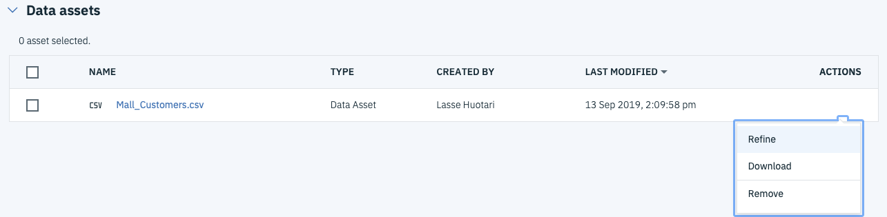

2. Näät datasetin sarakkeiden nimet data välilehdellä, ja datasetin rivien määrän oikeassa alakulmassa.

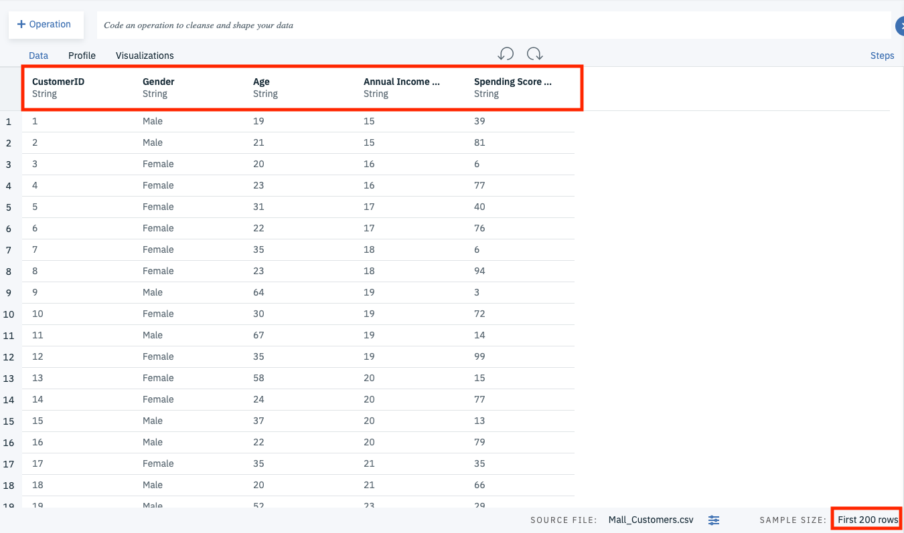

3. Tee havaintoja datasta. Tähän on kätevä työkalu visualisointi. Pääset tekemään visualisointeja, kun siirryt **Visualize** välilehdelle.

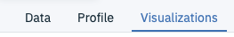

Ideana on että kuvaat datasta löytyviä havaintoja, esim keskiarvoa iästä, sukupuolesta ja vuotuisista tuloista. Tee omia visualisointeja, ja tallenna ne raporttiisi. Saat visualisoinnin tallennettua oikeassa reunassa olevasta **Save as Image** napista.

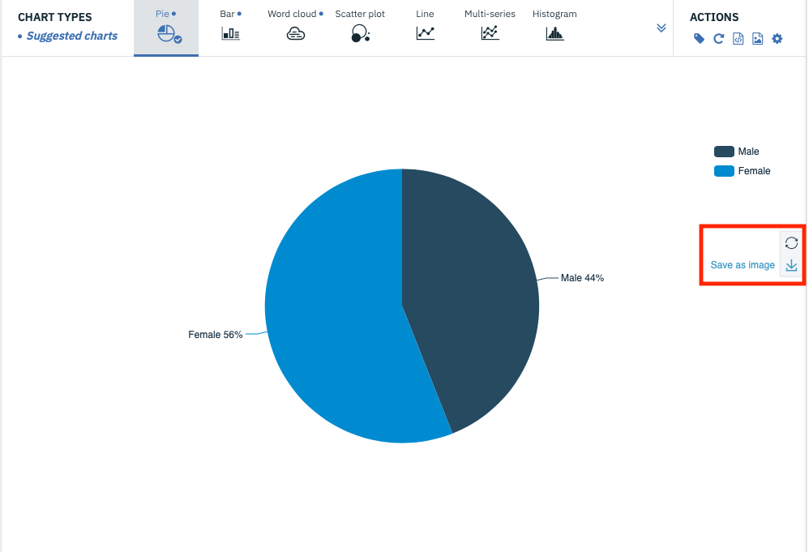

4. Lopuksi teemme Datan laatuanalyysin. Tähän tarkoitukseen käytämme SPSS Modeleria, joka löytyy myös Watson Studiosta. Palaa takaisin projektisi pääsivulle painamalla projektin nimeä vasemmasta yläkulmasta.

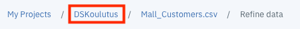

5. Palattuasi projektin assets sivulle paina **Add to project** nappia.

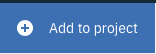

6. Valitse aukeavasta listasta **Modeler Flow**

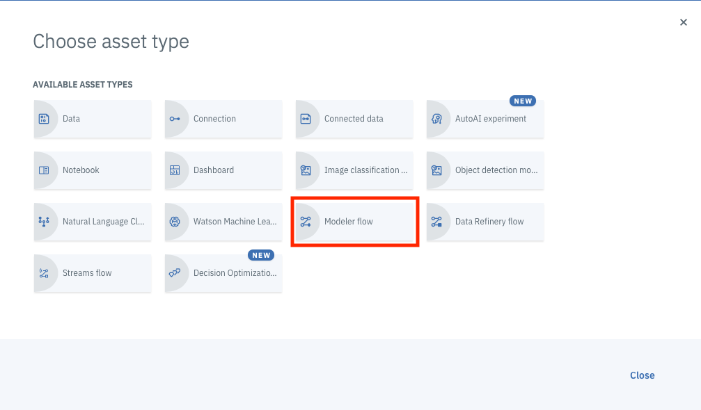

7. Anna Flowle nimi, nimeä flow yleispätevästi, koska tulemme käyttämään samaa flowta myöhemmin projektissa. Ja paina **Create**

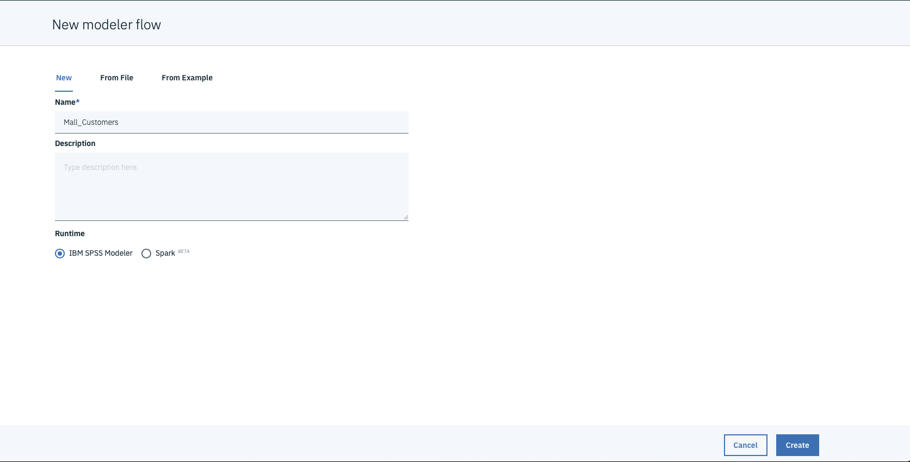

8. Tämän jälkeen eteesi avautuu SPSS modeler kanvas. Tulemme myöhemmin rakentamaan esimerkiksi mallinnuksen tässä työkalussa. Ensimmäiseksi valitse vasemmalta näkyvästä valikosta **Import** kohta ja sieltä löydät **Data asset** noden.

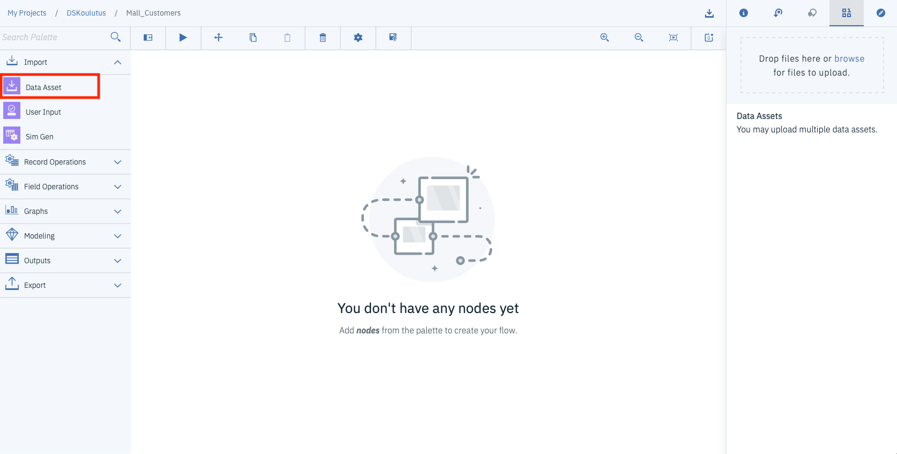

9. Raaha ja pudota **Data Asset** node kanvakselle ja klikkaa nodea. Sinulla pitäisi olla nyt tälläinen näkymä esillä.

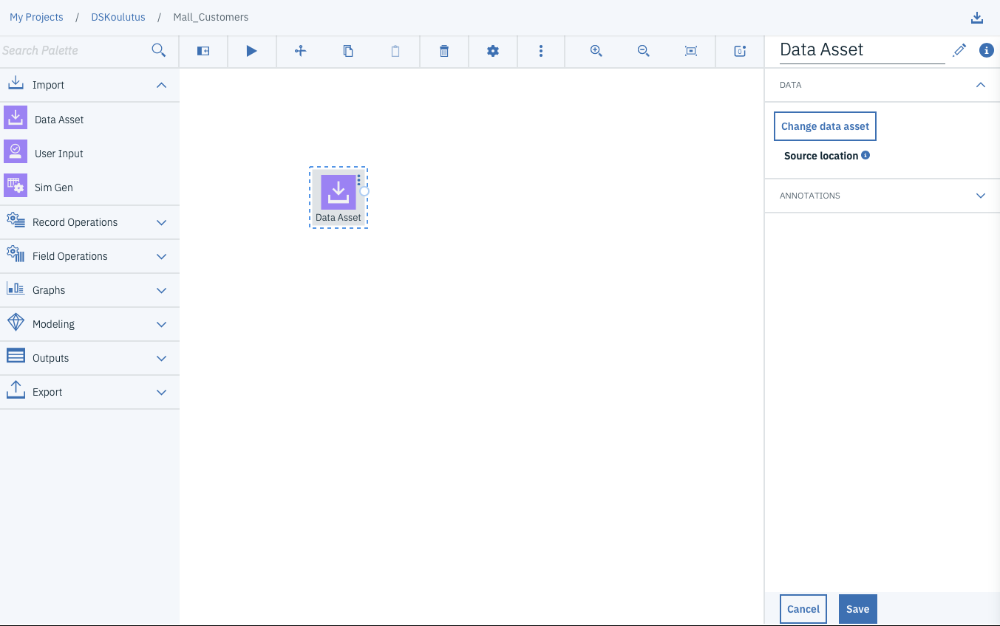

10. Valitse **Change data asset**

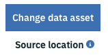

11. Valitse **Data Asset** ja sen jälkeen valitse **Mall_customers.csv** ja paina **OK**

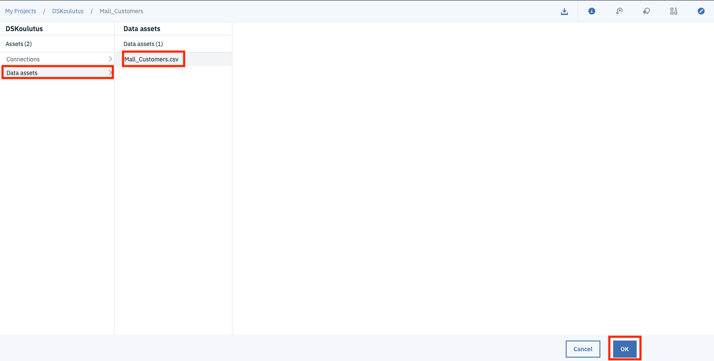

12. Paina **Save** oikeasta alakulmasta.

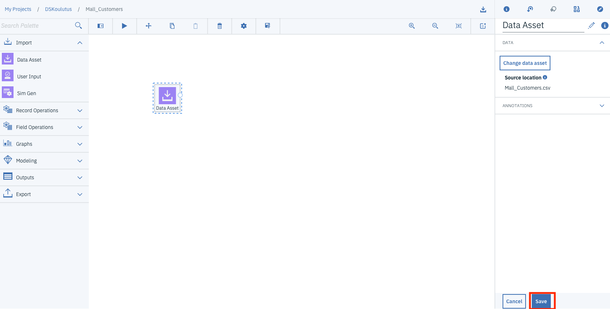

13. Seuraavaksi valitse vasemmalta valikosta **Outputs** valikko, ja raahaa ja pudota **Data audit** node kanvakselle. Yhdistä nodet toisiinsa.

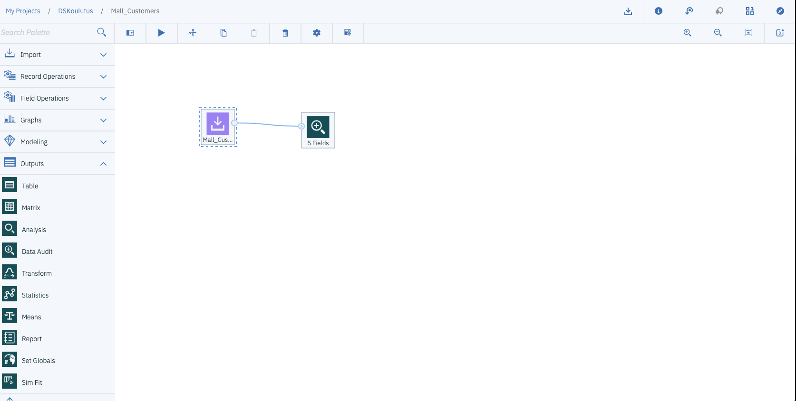

14. Paina Run

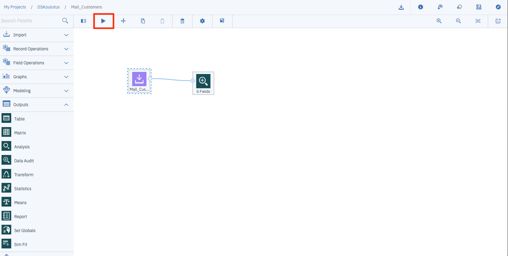

15. Tupla klikkaa oikealle avautuvasta valikosta **Data audit of..** kuvaketta

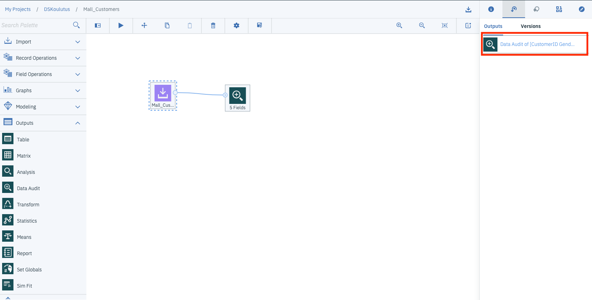

16. Raportoi datan laatu, esimerkiksi mahdolliset puutteet datassa, outlierit ja extremet, ja muut havainnot raporttiin

