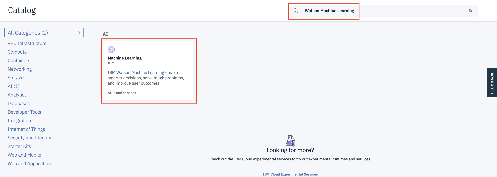
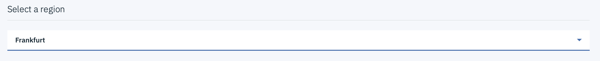
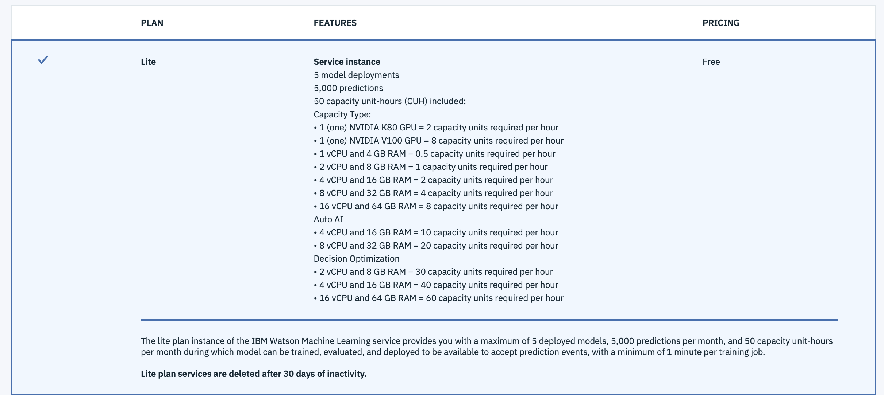
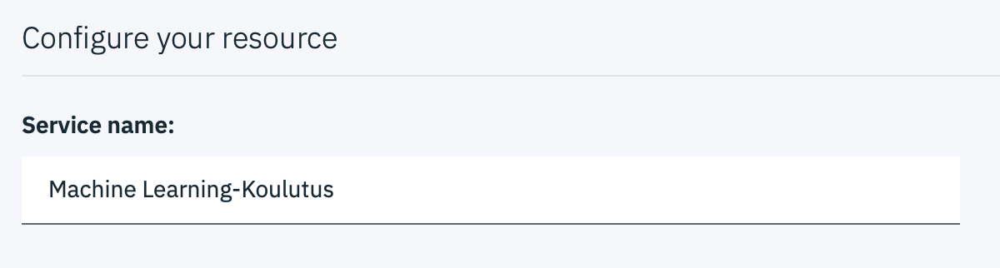
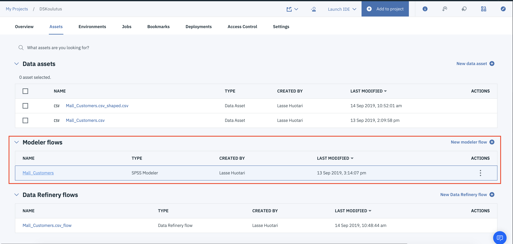

# Mallin tuotteistaminen

Kuten mainittua tämän harjoituksen tarkoituksena on tehdä asiakkaalle rest-API rajapinta, jota pitkin he voivat kutsua malliaan. Tehdäksesi tämän harjoituksen tarvitse Watson Machine Learning instanssin. Saat tehtyä itsellesi kyseisen instanssin seuraamalla alla olevia ohjeita.

1. Mene osoitteeseen <a href="https://cloud.ibm.com" target="_blank">cloud.ibm.com</a> ja kirjaudu sisään.

2. Valitse oikealta ylhäältä **Catalog**

3. Hae Watson Machine Learning, ja klikkaa palvelua listassa.

4. Valitse Regioniksi Frankfurt, Varmista että Lite Plan on valittu ja nimeä instanssi

5. Paina create

6. Avaa Watson Studio projektisi, ja avaa aikaisemmin luomasi modeler flow.

