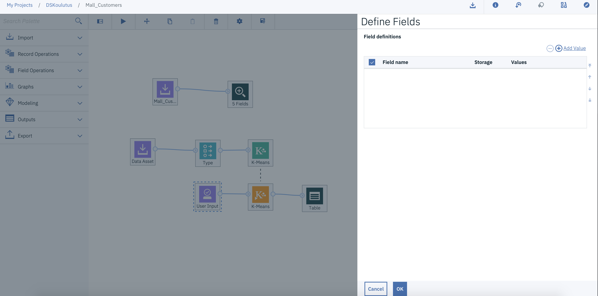

# Mallin tuotteistaminen

Kuten mainittua tämän harjoituksen tarkoituksena on tehdä asiakkaalle rest-API rajapinta, jota pitkin he voivat kutsua malliaan. Tehdäksesi tämän harjoituksen tarvitse Watson Machine Learning instanssin. Saat tehtyä itsellesi kyseisen instanssin seuraamalla alla olevia ohjeita.

1. Mene osoitteeseen <a href="https://cloud.ibm.com" target="_blank">cloud.ibm.com</a> ja kirjaudu sisään.

2. Valitse oikealta ylhäältä **Catalog**

3. Hae Watson Machine Learning, ja klikkaa palvelua listassa.

4. Valitse Regioniksi Frankfurt, Varmista että Lite Plan on valittu ja nimeä instanssi

5. Paina create

6. Avaa Watson Studio projektisi, ja avaa aikaisemmin luomasi modeler flow.

7. Poista valitsemasi mallin ja type noden välissä oleva viiva klikkaamalla viivaa hiiren oikealla napilla ja painamalla **Delete**

8. Raahaa import valikon alta **User Input** node kanvakselle ja yhdistä se kultaisen malli noden vasempaan reunaan.

9. Tupla klikkaa **User input** nodea ja paina **Define fields**

10. paina **Add value**

11. Kirjoita **Fields** kohtaan **Age**, vaihda **Storage** arvo **Integer** muotoon, ja paina **Edit** kuvaketta.

12. Anna iäksi jokin esimerkki arvo, esimerkiksi **28**. Ja paina **OK**

13. Toista sama Muuttujille

* Annual_Income
* Spending_Score

14. Lopuksi pitäisi näyttää tältä, asettamasi esimerkki arvot tietenkin voivat vaihdella. Paina **OK** ja sen jälkeen **Save**

15. Vie hiiri **Table** Noden päälle, ja paina kolmea pistettä, jonka jälkeen paina **Run**

16. Tupla klikkaa avautuvasta **Outputs** valikosta **Table (4 fields, 1 recors)** kuvaketta.

17. Nyt näät itse ennusteen tuloksen. Sarake $KM-K-Means kertoo mihin segmenttiin kyseinen asiakas ennusteen mukaan kuuluisi. Oma tuloksesi saattaa poiketa alla näkyvästä, koska saatoit valita eri määrän klustereita omaan malliisi, mutta taulukon rakenne pitäisi olla sama.

18. Palaa kanvakselle painamalla flow nimeä.

19. Seuraavaksi vie hiiri jälleen **Table** noden päälle ja valitse kolme pistettä, ja paina **Save branch as a model**

20. Anna mallillesi nimi, ja paina **Save**

21. Kun saat vahvistuksen että malli on tallentunut ja olet palannut takaisin kavakselle, palaa Projektin Asset sivulle painamalla projektin nimeä

22. Näät tallennetun mallin **Models** kohdassa. Paina Mallin nimeä.

23. Valitse Deployment välilehti ja paina **Add deployment**

24. Anna deploymentille nime, ja paina **Save**

25. Odota kunnes **Status** on **DEPLOY_SUCCESS** ja paina tämän jälkeen deploymentin nimestä.

26. Mene **Test** välilehdelle, syötä seuraava koodi **Enter input data** kenttään ja paina **Predict**

~~~
{"fields": ["Age","Annual_Income","Spending_Score"], "values": [[28,20,80]]}
~~~

27. Jos sait edellisen kaltaisen näkymän niin rest-API toimii, ja olet tuotteistanut mallisi tuotantoon. Jos haluat itse tehdä sovelluksen mallista, löydät tarkat kutsuohjeet eri koodikielillä **Implementation** välilehdeltä.
