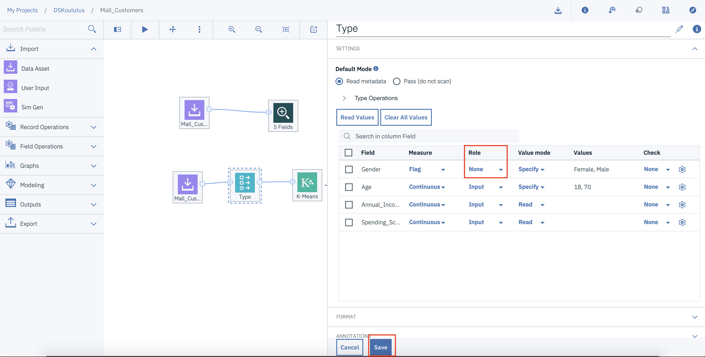
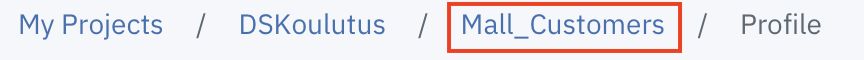

# Mallin rakentaminen

Nyt on aika rakentaa itse malli. Käy läpi raportti vielä kerran ja aloita sitten mallin rakentaminen alla olevien ohjeiden mukaan. Asiakas haluaa segmentoida asiakkaitaan eri ryhmiin, perustuen heidän keräämään tulemme siis rakentamaan klusterointi mallin.

1. Klikkaa aikaisemmin luomaasi Modeler Flowta projektisi assets sivulla.

2. Kanvaksella näkyy datan ymmärtämisen vaiheessa tehty flow. Voit jättää nuo nodet paikallee, tai poistaa ne.

3. Tuo kanvakselle uusi **Data Asset** node import valikon alta.

4. Tupla klikkaa tuomaasi **Data asset** nodea ja valitse **Change data asset**

5. Valitse **Data assets** sitten **Mall_Customer.csv_shaped.csv** data setti ja paina **OK**.

6. Muista painaa save.

7. Avaa **fiel operations** valikko vasemmalta, etsi **Type** node, raahaa se kanvakselle, ja yhdistä äskön lisäämämme **Data asset** nodeen.

1

8. Seuraavaksi muokkaamme **Type** noden asetuksia. Tupla klikkaa **Type** nodea. Vaihdat seuraavat kohdat:

* Gender -> Input -> None

Paina tämän jälkeen **Save**

9. Seuraavaksi tuomme itse mallin kanvakselle. Avaa **Modelling** valikko ja raahaa **K-Means** node kanvakselle, ja yhdistä se **Type** nodeen.

10. Seuraavaksi koulutamme mallin. Vie hiiri K-Means noden päälle kanvaksella, ja paina kolmea pistettä. Tämän jälkeen valitse **Run**. Modeler kouluttaa tämän jälkeen ensimmäisen version mallista.

11. Hetken päästä kanvakselle ilmestyy kultainen **K-Means** node, tämä on mallisi. Viel hiiri tämän noden päälle, ja paina kolmea pistettä, ja valitse valikosta **View Model**.

12. Eteesi avautuu mallin tietoja, Tutustu tästä <a href="https://www.dummies.com/programming/big-data/data-science/data-clustering-with-the-k-means-algorithm/">linkistä K-Means mallin perusteisiin.</a> Arvioi mallin sopivuutta saamaasi tehtävään. Toinen hyvä tapa arvioida mallin toimivuutta on visualisoida tuloksia. Pystyt visualisoimaan tuloksia seuraavien ohjeiden mukaan.

13. Valitse vasemmalta valikosta **Outputs** osio ja valitse sieltä **Table** node raahaa se kanvakselle, ja yhdistä kultaiseen malli nodeen.

14. Vie hiiri **Table** noden päälle ja paina kolmea pistettä. Valitse **Profile**

15. Valitse avautuvasta ikkunasta **Visualize** välilehti.

16. Tee eri visualisointeja, joilla selviää miten klusterit ovat rakentuneet. Vinkki, color optionissa kannattaa käyttää **$KM-K-Means** muuttujaa

17. Kun olet rakentanut visualisoinnin on aika rakentaa toinen versio mallista. Palaa takaisin kanvakselle painamalla Kavaksen nimeä vasemmasta ylänurkasta

18. Muista dokumentoida kaikki löydöksesi kyseisestä mallista tarkasti dokumenttiin.

19. Seuraavaksi on kaksi vaihtoehtoa. Joko poistat jo luodun mallin kanvakselta, tai sitten toista mallin tuonti prosessin kanvakselle. Käytämme mallin tuunauksessa samaa K-Means algoritmia.

20. Mallissa kavakselle on tuotu uusi K-Means node, ja se on yhdistetty **Type** nodeen. Tarkoituksena on parantaa mallin soveltuvuutta muuttamalla sen asetuksia. Pääset muuttamaan asetuksia tuplaklikkaamalla vihreää malli nodea. K-Means klusteroinnin mallinsopivuuden parantaminen tapahtuu klustereiden määrän muokkauksella. Avaa valikosta **Build Options** valikkoa, ja siellä voit muokata klustereiden määrää kohdassa **Number Of Clusters** Kokeile eri arvoja, ja kouluta malli aikaisemmin esitetyllä tavalla. Suorita mallille samoja arviointi toimenpiteitä kuin aikaisemmin teimme, ja dokumentoi nämä raporttiin.

