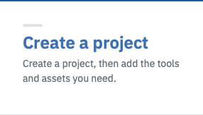
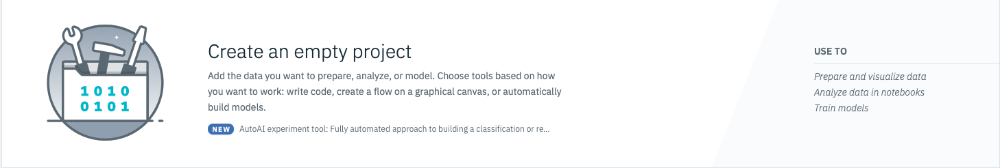
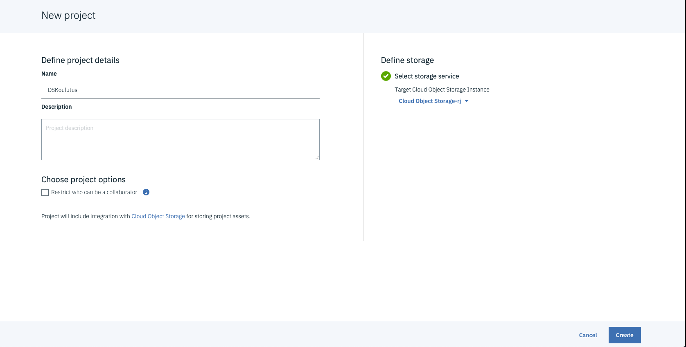
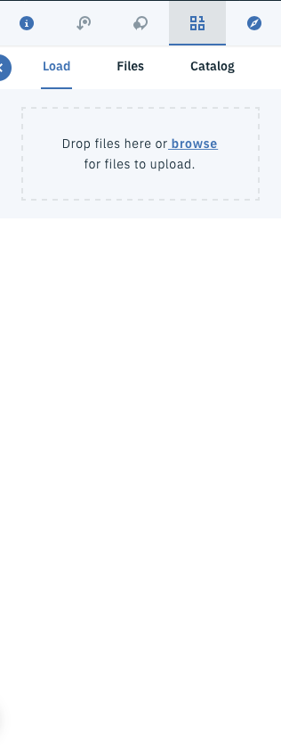
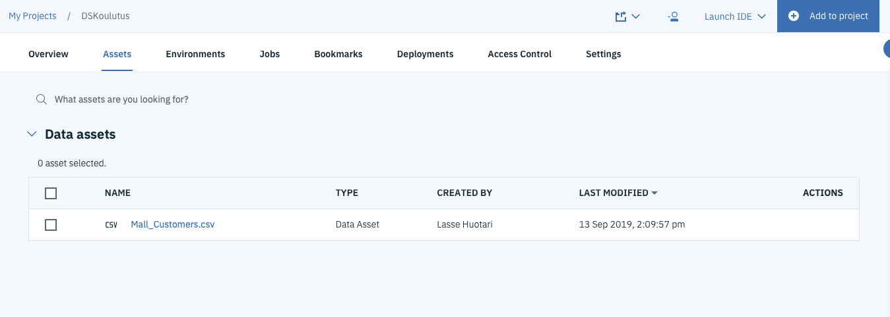

# Watson Studio projektin luominen ja datan lisääminen

1. Kirjaudu sisään Watson Studio ympäristöösi, jos ehdit sulkemaan välilehden pääset sinne takaisin <a href="eu-de.dataplatform.cloud.ibm.com">tästä</a>

2. Paina **Create a Prject** nappia.

3. Valitse **Create an empty project**

4. Anna projektille nimi ja valitse Cloud object storage, jos sinulla ei ole cloud object storage luo uusi ohjeiden mukaan. Ja paina **Create**

5. Siirry **Assets** välilehdelle.

6. Etsi nyt lataamasi datasetti tietokoneeltasi, ja raahaa ja pudota se **Drop files here or browse for files to upload.** kohtaan sivun oikeassa laidassa.

7. Datasetin tulee näkyviin assets välilehden **Data assets** kohtaa.

