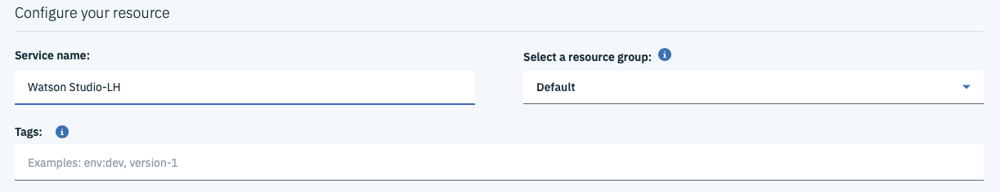

# Watson Studion käyttöönotto

1. Kirjaudu ensin IBM tilillesi IBM Cloudiin osoitteessa <a href="https://cloud.ibm.com">cloud.ibm.com</a>

2. Valitse oikealta ylhäältä työkalu riviltä **Catalog** nappi.

3. Käytä hakutoimintoa ja etsi Watson Studio

4. Valitse Watson Studio

5. Valitse Regioniksi Frankfurt

6. Varmista että Lite plan on valittu

7. Rullaa alas ja nimeä Watson Studio esimerkiksi omilla nimikirjaimilla

8. Paina **Create**

9. Saat näkyviin alla olevan ikkunan. Paina **Get Started** ja pääset Watson Studio ympäristöösi.

